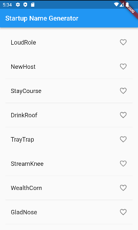

```
import 'package:flutter/material.dart';
import 'package:english_words/english_words.dart';

void main() => runApp(MyApp());  // 한줄 함수 또는 메서드에 화살표 표기법을 사용

class MyApp extends StatelessWidget {
  // StatelessWidget : 상태정보가 없는 widget, 즉 변경이 일어나지 않는것 , 앱로고 같은 것것
 @override
  Widget build(BuildContext context) {
    // final wordPair = WordPair.random();
    return MaterialApp(    // 머티리얼 : 모바일 및 앱에서 표준으로 사용되는
      //시각 디자인 언어
      title: 'Startup Name Generator',
      home: RandomWords(),
    );
  }
}

class RandomWordsState extends State<RandomWords>{
  final _suggestions = <WordPair>[];
  final _saved = <WordPair>{};
  //_saved Set합니다 _RandomWordsState. 이것은 Set사용자가 즐겨찾는 단어 쌍을 저장합니다.
  // 적절하게 구현 되어 중복 항목을 허용하지 않기 때문에 Set선호됩니다
  final _biggerFont = const TextStyle(fontSize: 18.0);
  @override
  Widget build(BuildContext context) {
    return Scaffold(
      appBar: AppBar(
        title: Text('Startup Name Generator'),
      ),
      body: _buildSuggestions(),
    );
  }
  Widget _buildSuggestions() {
    return ListView.builder(
        padding: const EdgeInsets.all(16.0),
        itemBuilder: /*1*/ (context, i) {
          //itemBuilder 콜백은 단어 쌍이 제안될 때마다 호출되고 각각을 ListTile 행에 배치합니다.
          // 짝수 행인 경우 ListTile 행에 단어 쌍을 추가합니다. 홀수 행인 경우 시각적으로 각 항목을
          // 구분하는 Divider 위젯을 추가합니다. 작은 기기에서는 구분선을 보기 어려울 수 있습니다.
          if (i.isOdd) return Divider(); // ListView의 각 행 앞에 1 픽셀 높이의 구분선 위젯을 추가하십시오.

          final index = i ~/ 2;
          //i ~/ 2 표현식은 i를 2로 나눈 뒤 정수 결과를 반환합니다. 예를 들어: 1, 2, 3, 4, 5는 0, 1, 1, 2, 2가 됩니다.
          // 이렇게 하면 구분선 위젯을 제외한 ListView에 있는 단어 쌍 수가 계산됩니다.
          if (index >= _suggestions.length) {
            _suggestions.addAll(generateWordPairs().take(10));
            //가능한 단어 쌍을 모두 사용하고 나면, 10개를 더 생성하고 제안 목록에 추가합니다.
            //_buildSuggestions() 함수는 단어 쌍 마다 한 번 씩 _buildRow()를 호출합니다.
            // 이 함수는 ListTile에서 각각 새로운 쌍을 표시하여 다음 단계에서 행을 더 매력적으로 만들 수 있게 합니다.
          }
          return _buildRow(_suggestions[index]);
        });
  }
  Widget _buildRow(WordPair pair) {
    final alreadySaved = _saved.contains(pair);
    //_buildRow기능에서 단어 쌍이 이미 즐겨찾기에 추가되지 않았는지 확인하는 검사
    // alreadySaved를 추가합니다.
    return ListTile(
      title: Text(
        pair.asPascalCase,
        style: _biggerFont,
      ),
    trailing: Icon(
       alreadySaved ? Icons.favorite : Icons.favorite_border,
       color: alreadySaved ? Colors.red : null,
       semanticLabel: alreadySaved ? 'Remove from saved' : 'Save',
      ),
     //즐겨찾기를 활성화 _buildRow()하기 위해 개체에 하트 모양 아이콘을 추가합니다.
      // ListTile다음 단계에서는 하트 아이콘과 상호 작용하는 기능을 추가합니다.
    );
  }
}

// RandomWordsState는 RandomWords 클래스에 의존적
class RandomWords extends StatefulWidget {
  @override
  RandomWordsState createState() => RandomWordsState();
}
```



결과물